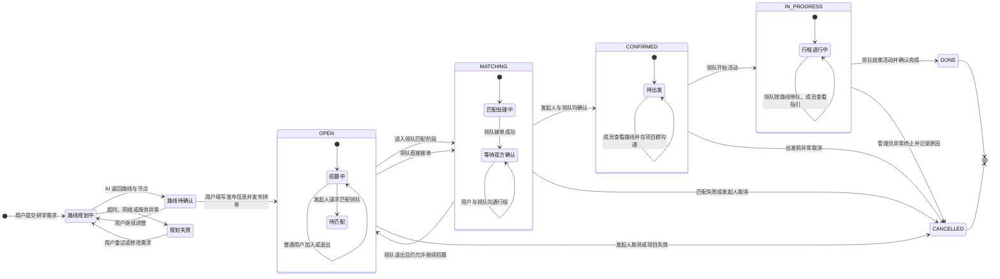
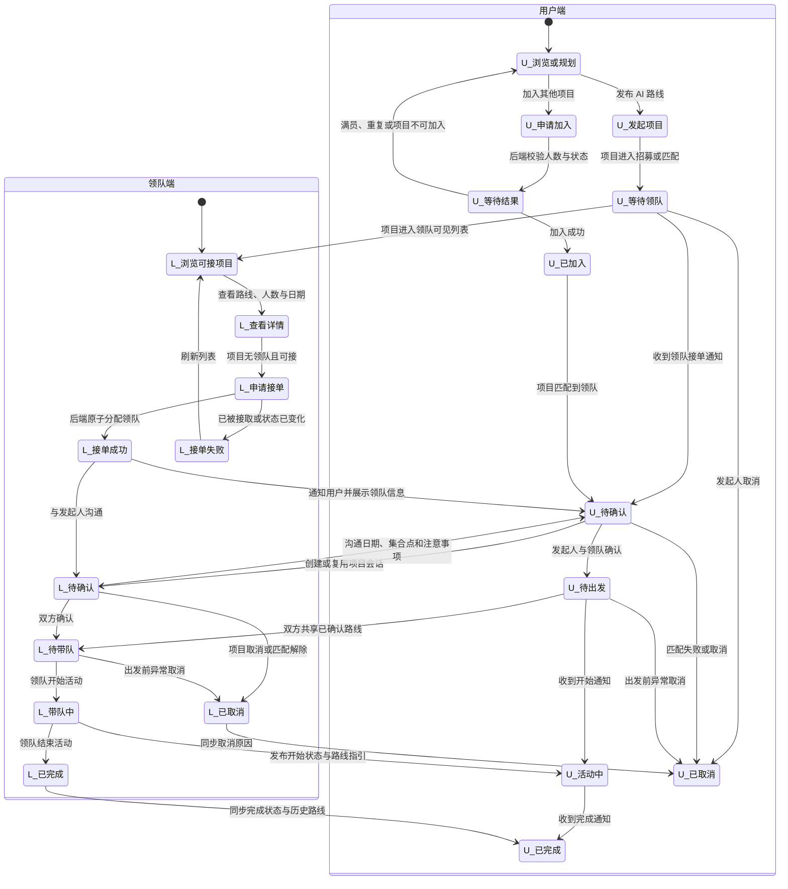

# 用户与领队交互状态图

> 本图基于当前项目中的 `OPEN`、`MATCHING`、`CONFIRMED`、`IN_PROGRESS`、`DONE`、`CANCELLED` 六种项目状态，并补充形成完整业务闭环所需的角色动作。

## 1. 项目生命周期状态图

## 2. 用户与领队交互状态图

## 3. 状态转换权限表

| 当前状态 | 触发动作 | 操作者 | 前置条件 | 目标状态 | 失败处理 |
|---|---|---|---|---|---|
| 未发布 | 发布项目 | 用户/发起人 | 已登录、路线有效、发布字段合法 | `OPEN` | 保留表单并允许重试 |
| `OPEN` | 加入项目 | 普通用户 | 非发起人、未加入、未满员 | `OPEN` | 刷新最新人数与按钮状态 |
| `OPEN` | 进入匹配 | 发起人或系统 | 项目仍有效 | `MATCHING` | 维持 `OPEN` 并提示原因 |
| `OPEN`/`MATCHING` | 接单 | 领队 | 无现有领队、账号有领队权限 | `MATCHING` | 并发失败后刷新项目 |
| `MATCHING` | 双方确认 | 发起人和领队 | 已有领队、满足成团条件 | `CONFIRMED` | 显示仍待确认的一方 |
| `MATCHING` | 领队退出 | 领队/管理员 | 尚未确认且符合退出规则 | `OPEN` | 保留原状态并说明限制 |
| `CONFIRMED` | 开始活动 | 当前领队 | 到达允许开始时间 | `IN_PROGRESS` | 保留原状态并记录失败 |
| `IN_PROGRESS` | 完成活动 | 当前领队 | 活动已开始 | `DONE` | 保留原状态并允许重试 |
| `OPEN`/`MATCHING` | 取消项目 | 发起人 | 未开始且满足取消规则 | `CANCELLED` | 保留原状态并提示原因 |
| `CONFIRMED` | 异常取消 | 发起人、领队或管理员 | 二次确认并填写原因 | `CANCELLED` | 保留原状态并通知相关方 |
| `IN_PROGRESS` | 异常终止 | 管理员 | 必须记录原因与审计信息 | `CANCELLED` | 进入人工处理流程 |

## 4. 交互约束

1. 加入、接单和所有项目状态转换必须由后端原子处理，客户端按钮禁用只能减少重复点击，不能替代并发控制。
2. 每次状态转换应返回最新项目数据，包括状态、成员数、领队 ID、更新时间和当前用户关系。
3. 领队接单后，应为项目成员创建或复用项目会话，并向用户发送站内通知。
4. `CONFIRMED` 后默认不允许新成员直接加入；如业务允许补位，应设计独立的审批流程。
5. `DONE` 和 `CANCELLED` 是终态，普通客户端不能重新打开；恢复操作只能由后台审计流程完成。
6. 任何取消操作都必须记录操作者、时间和原因，并同步通知发起人、成员和领队。

## 5. 当前代码覆盖情况

| 能力 | 当前覆盖 | 说明 |
|---|---|---|
| AI 路线生成与地图预览 | 已覆盖 | 已调用路线接口并使用高德地图规划步行线路 |
| 用户发布 `OPEN` 项目 | 部分覆盖 | 发布字段目前多为默认值，缺少完整发布表单 |
| 用户加入项目 | 已覆盖基础流程 | 支持 `OPEN`/`MATCHING` 且未满员时加入 |
| 领队接单 | 已覆盖基础流程 | 支持无领队的 `OPEN`/`MATCHING` 项目 |
| 项目会话创建 | 部分覆盖 | 用户加入已有领队项目时会尝试创建会话 |
| 项目消息同步 | 未形成闭环 | 现有消息主要保存在本地 SQLite，并含演示会话 |
| 用户退出/发起人取消 | 未覆盖 | 当前网络接口未定义对应操作 |
| 双方确认 | 未覆盖 | 缺少确认接口和操作页面 |
| 开始、完成、异常取消 | 未覆盖 | 已有状态展示，但缺少状态转换接口 |

因此，第一张图是建议采用的完整业务状态机；不能仅依据客户端已有按钮认定全部状态转换已经实现。
